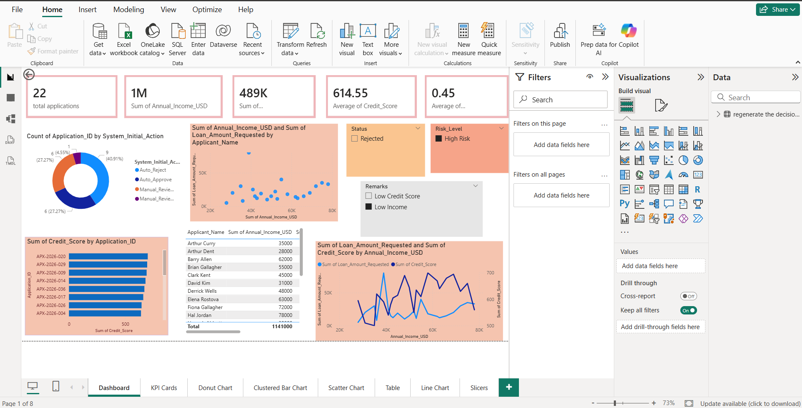
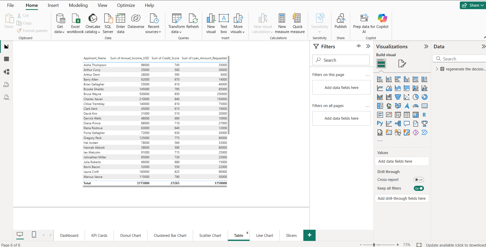
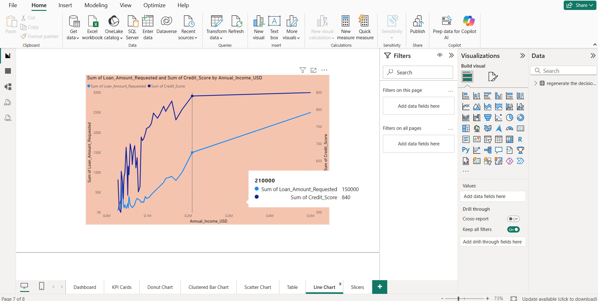

# Financial & Application Risk Analysis Dashboard

An interactive **Power BI Dashboard** designed to analyze application data, evaluate financial risk profiles, and monitor key performance indicators (KPIs) for applicant decision-making.

---

## 📊 Dashboard Overview

This Power BI project provides a comprehensive overview of applicant profiles, underwriting metrics, and risk classifications. It allows stakeholders to slice data by approval status, risk levels, and rejection remarks to identify core demographic and financial trends.

---

## 📈 Key Visuals & Pages

The repository contains documentation and assets for the following dashboard components, as seen across the report tabs:

### 1. Dashboard (Main Overview)
The primary landing page combining high-level metrics with distribution charts to give an immediate health check of the application pipeline.

### 2. KPI Cards
A dedicated view of high-level aggregated metrics including total applications, financial sums, and average credit scoring.
* **Metrics Tracked:** Total Applications, Sum of Annual Income, Average Credit Score, etc.

### 3. Donut Chart
Displays the proportional breakdown of application counts categorized by the system's initial action.
* **Focus:** `Count of Application_ID by System_Initial_Action` (Auto-Reject, Auto-Approve, Manual Review).

### 4. Clustered Bar Chart
A horizontal bar chart ranking credit metrics against individual application identifiers.
* **Focus:** `Sum of Credit_Score by Application_ID`.

### 5. Scatter Chart
Maps the correlation between an applicant's annual income and the specific loan amount they requested.
* **Focus:** `Sum of Annual_Income_USD` vs. `Sum of Loan_Amount_Requested`.

### 6. Table
A detailed tabular breakdown mapping specific applicant names directly to their declared annual income for granular auditing.
* **Focus:** `Applicant_Name` and `Sum of Annual_Income_USD`.

### 7. Line Chart
A dual-axis line chart illustrating the relationship and variance trends between loan amounts requested and credit scores over income intervals.
* **Focus:** `Sum of Loan_Amount_Requested` and `Sum of Credit_Score by Annual_Income_USD`.

### 8. Slicers
Interactive UI components allowing users to dynamically filter the entire report canvas.
* **Filters Included:** Status (e.g., Rejected), Risk Level (e.g., High Risk), and Remarks (e.g., Low Credit Score, Low Income).

---

## 🛠️ Tools & Technologies Used

* **Power BI Desktop:** For data modeling, DAX calculations, and report visualization.
* **Power Query:** For data cleaning, transformation, and column profiling.
* **DAX (Data Analysis Expressions):** Used to build explicit measures for averages and financial aggregates.

---

## 🚀 How to Use the Report

1. Clone this repository to your local machine.
2. Ensure you have the latest version of **Power BI Desktop** installed.
3. Open the `.pbix` file located in the root folder.
4. Use the bottom navigation tabs to switch between specific deep-dive views (**KPI Cards**, **Donut Chart**, etc.).
5. Use the **Slicers panel** on the right side of the main dashboard canvas to interactively filter data by Risk Level or Status.
