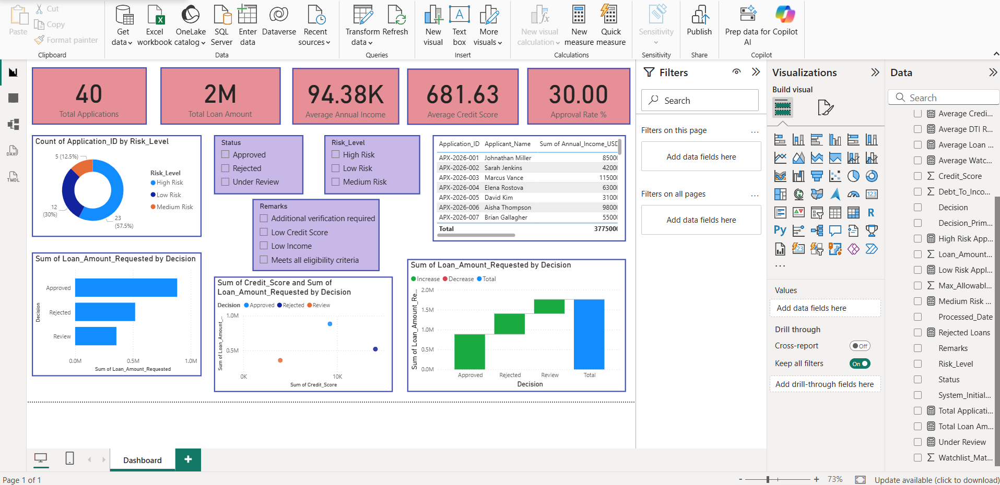
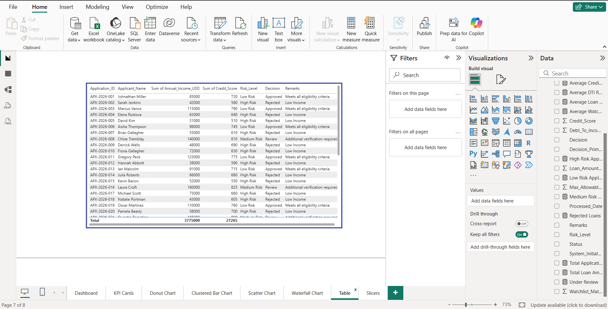
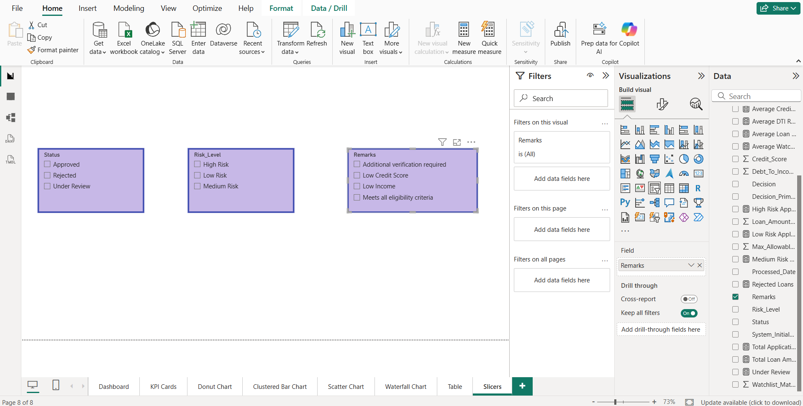

# Loan Application Analysis Dashboard (Power BI)

An interactive Power BI dashboard designed to monitor, track, and analyze loan applications. This project provides end-to-end insights into application volumes, risk distributions, financial metrics, and approval behaviors to support data-driven decision-making in financial processing.

---

## 📊 Dashboard Overview

The complete dashboard synthesizes high-level KPIs with detailed risk breakdown distributions and trend charts. This unified view helps credit analysts and stakeholders quickly evaluate loan portfolio health.

### Main Dashboard Page

---

## 🛠️ Individual View Breakdowns

The workbook is systematically organized into focused reporting pages. Below are the individual components and visual layers included in this project:

### 1. KPI Cards
* **Purpose:** Summarizes core operational operational metrics at a glance.
* **Metrics Displayed:** Total Applications, Total Loan Amount ($2M), Average Annual Income ($94.38K), Average Credit Score (681.63), and overall Approval Rate % (30.00%).
* **Visual:**
    

### 2. Donut Chart (Risk Classification)
* **Purpose:** Breaks down total applications by their assigned risk profile tier.
* **Metrics Displayed:** Distribution count and percentages across High Risk, Low Risk, and Medium Risk applications.
* **Visual:**
    

### 3. Clustered Bar Chart
* **Purpose:** Compares the aggregate financial volumes requested against their processing decisions.
* **Metrics Displayed:** Sum of Loan Amount Requested split by Approved, Rejected, and Review statuses.
* **Visual:**
    

### 4. Scatter Chart
* **Purpose:** Correlates the applicant's creditworthiness against the volume of financing requested.
* **Metrics Displayed:** Relationship between the Sum of Credit Score and Sum of Loan Amount Requested, color-coded by final decision status.
* **Visual:**
    

### 5. Waterfall Chart
* **Purpose:** Illustrates the cumulative build-up of total loan values across separate underwriting channels.
* **Metrics Displayed:** Sequential distribution step-up from Approved, Rejected, to Under Review categories to sum the overall portfolio pipeline.
* **Visual:**
    

### 6. Granular Data Table
* **Purpose:** Provides a deep-dive tabular view for operational lookups and historical auditing.
* **Fields Included:** Application ID, Applicant Name, Annual Income, Credit Score, Risk Level, Status Decision, and processing Remarks.
* **Visual:**
    

### 7. Interactive Slicers
* **Purpose:** Enables cross-filtering across pages to segment the entire data canvas by specific categories.
* **Filter Controls:** Application Processing Status (Approved/Rejected/Under Review), Risk Level Tiers, and operational Underwriting Remarks.
* **Visual:**
    

---

## 💡 Key Insights Generated

* **Approval Performance:** The portfolio currently registers a strict 30% approval rate, representing roughly $1M of the total $2M requested volume.
* **Risk Profile Risk Concentration:** High-risk applications make up the largest individual share of incoming volume (57.5%), highlighting the critical need for robust automated slicer filtering.
* **Credit Correlation:** The scatter evaluation clearly flags a grouping where lower credit scores are reliably funneled into "Review" or "Rejected" status buckets.

## 🚀 How to Use the Power BI File (.pbix)

1. Clone this repository to your local machine.
2. Ensure you have **Power BI Desktop** installed.
3. Open the `.pbix` file.
4. Replace the sample underlying data source connection with your live database or clean Excel sheet if required.
